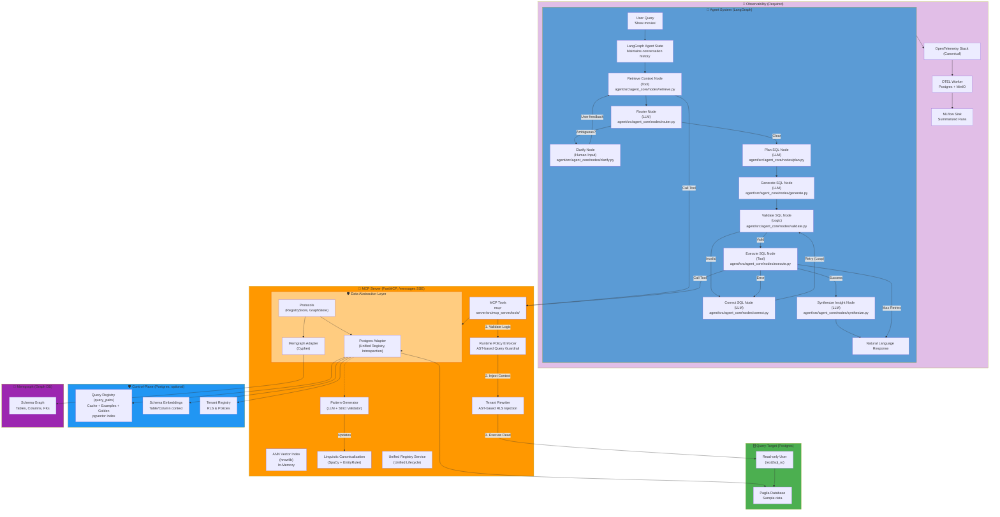

# Text 2 SQL

A natural language interface that enables users to query databases using plain English. This project demonstrates an intelligent system that bridges the gap between natural language and SQL.

The system automatically:
*   **Understands intent**: Deciphers the meaning behind user questions.
*   **Retrieves context**: Finds relevant database tables and schemas.
*   **Executes securely**: Generates and runs SQL queries with built-in safety checks.
*   **Formats results**: Returns data in a clear, user-friendly format.

Designed for security and scalability, it uses modern containerization and secure access patterns to ensure robust performance.

## System Flow




## Key Features & Architecture

### 🔍 Retrieval Augmented Generation (RAG) Using Approximate Nearest Neighbors (ANN)
*   **Dense Schema Linking**: Uses a **Triple-Filter Strategy** (Structural Backbone, Value Spy, Semantic Reranker) to intelligently prune relevant tables and columns, resolving "Context Starvation".
*   **Scalable Vector Search**: Implements **HNSW (Hierarchical Navigable Small Worlds)** via `hnswlib` for millisecond-latency search across schema embeddings and few-shot examples.
*   **Graph-Aware RAG**: Integrates Memgraph to traverse database relationships (Foreign Keys), ensuring retrieved contexts maintain relational integrity.
*   **Enriched Ingestion**: Automatically generates high-fidelity descriptions and embeddings during seeding, ensuring the agent understands business domain semantics.

### 🚀 Unified NLQ↔SQL Registry & Semantic Caching
*   **Canonical Identifiers**: Every query pair is anchored by a **SpaCy-generated signature key**, ensuring that semantically identical questions share a single source of truth.
*   **Automated Pattern Discovery**: A dedicated **Pattern Generation Agent** introspects the database and uses an LLM to generate colloquial synonyms for domain-specific values (e.g., "active" → "live", "running"), normalized and validated before being compiled into the SpaCy EntityRuler.
*   **Multi-Role Lifecycle**: A single entry in the `query_pairs` registry can serve multiple roles:
    *   **Cache**: Fast runtime lookups for repeating queries.
    *   **Example**: High-quality few-shot examples for LLM guidance.
    *   **Golden**: Verified test cases for evaluation and regression testing.
*   **Trust Levels**: Clear distinction between `verified` human-curated data and `autogenerated` machine results.
*   **Deterministic Guardrails**: Cache hits are cross-verified via AST parsing to ensure SQL predicates match user intent.

### 🛡️ Extensible Foundation: Multi-Provider LLM & Multi-Engine Database Support
*   **Extensible Tooling**: Built on the **Model Context Protocol (MCP)**, making database tools accessible to any MCP-compliant agent or client.
*   **Data Abstraction Layer (DAL)**: Decouples business logic from storage with strict interfaces (`RegistryStore`, `GraphStore`) and pluggable provider adapters where implemented. Today, Postgres (registry / metadata) and Memgraph (graph traversal) are the supported backends. Planned extensions to additional data sources (e.g. MySQL and other analytical backends) are tracked in [Issue #62](https://github.com/jonkmatsumo/text2sql/issues/62) and are not yet implemented.
*   **Runtime Policy Enforcement**: Supports an optional **dual-database architecture** to separate sensitive control-plane data (tenants, keys, registry) from the query-target data.
*   **AST-Based Security**: Employs `sqlglot` for AST traversal to strictly enforce read-only access and inject tenant isolation predicates at runtime.
*   **Provider Agnostic**: Seamlessly switch between OpenAI, Anthropic, and Google Gemini via a unified LLM client factory.

### 📡 Observability (OTEL-First)
*   **Canonical Tracing**: All services emit to OpenTelemetry by default (`TELEMETRY_BACKEND=dual`).
*   **Durable Sink**: The OTEL worker provides persistent storage (Postgres) and raw archives (MinIO).
*   **MLflow Run Sink**: High-level metrics and trace summaries are automatically exported to MLflow for experiment tracking.
*   **Access Point**: Query the OTEL worker API at `http://localhost:4320/api/v1/traces`.
*   **MLflow Run Sink**: MLflow acts solely as a downstream sink for experiment tracking. Traces are not sent directly to MLflow; they are exported by the OTEL worker to the `otel-traces` experiment.

## Project Structure

```text
text2sql/
├── agent/                      # LangGraph AI agent
│   ├── src/agent_core/         # Core logic (nodes, graph, state)
│   ├── tests/                  # Unit tests (Mocked)
│   └── scripts/                # Evaluation & maintenance scripts
├── mcp-server/                 # Database access tools (FastMCP)
│   ├── src/mcp_server/         # Server implementation
│   │   ├── dal/                # Data Abstraction Layer (Interfaces & Adapters)
│   │   ├── services/           # Schema linking, indexing, and caching
│   │   └── tools/              # MCP Tool definitions
├── database/                   # Seed assets
│   ├── query-target/           # Target DB schema, data, and patterns
│   └── control-plane/          # App metadata, RLS, and cache schema
├── streamlit/                  # Streamlit packaging + Docker assets
├── streamlit_app/              # Streamlit UI entrypoint (Text_2_SQL_Agent.py)
├── observability/              # Optional OTEL stack
├── docker-compose.infra.yml    # Infrastructure services (Postgres, MinIO, etc.)
├── docker-compose.app.yml      # Application services (Python apps)
└── docker-compose.test.yml     # Test DB compose file
```

## Quick Start

### Prerequisites
*   Docker & Docker Compose
*   Python 3.12+ (for local development)

### Environment Configuration (Non-Telemetry)

Create a local `.env` from the template:
```bash
cp .env.example .env
```

Do not rely on hardcoded defaults for passwords or secrets; set them explicitly.

Environment variables are grouped by category (not exhaustive):
*   **Core DB connection**: Postgres host/port/name/user/password used by DAL-backed stores.
*   **MCP connectivity**: MCP server URL and transport for agent/UI calls.
*   **LLM provider selection**: Provider + model settings and provider API key.
*   **DAL provider selectors**: Optional overrides to choose storage backends.

## Local Development

### 1. Initial Setup

Before starting, bootstrap the local data directories:

```bash
./scripts/bootstrap_local_data.sh
```

### 2. Services Bring-Up

We use a "pull-and-run" model for infrastructure to avoid unnecessary local builds.

**Infrastructure (No Build)**
Starts Postgres, MinIO, Memgraph, MLflow. These use pinned images and do not rebuild.

```bash
docker compose -f docker-compose.infra.yml up -d
```

**Application (Build)**
Starts API Server, Streamlit App, Seeder, and Workers. Checks for code changes.

```bash
docker compose -f docker-compose.infra.yml \
  -f docker-compose.app.yml \
  up -d --build
```

**Optional: Observability**
Starts OTEL Collector alongside infra and app.

```bash
docker compose -f docker-compose.infra.yml \
  -f observability/docker-compose.observability.yml \
  up -d
```

### 3. Development Workflow (Hot Reload)

Source code is bind-mounted into containers for hot reload.
- **Streamlit**: Edits to `streamlit/`, `agent/`, `mcp-server/` are reflected immediately.
- **MCP Server**: Edits to `mcp-server/src` are reflected immediately.
- **OTEL Worker**: Edits to `observability/otel-worker/src` are reflected immediately.

**Note**:
- Large directories (`.git`, `local-data`, `docs`) are **not** mounted.
- Dependency changes (e.g., `pyproject.toml`) always require a rebuild (`--build`).
- If a code change is not reflected, rebuild the app service.

### 4. Cleanup

We provide `make` targets for safe and deep cleanup.

| Command | Action | Impact |
|---------|--------|--------|
| `make docker-clean` | Stops containers, prunes dangling images | **Safe** (No data loss) |
| `make docker-clean-deep` | Also prunes unused images/cache | **Safe** (Reclaims disk) |
| `make docker-nuke` | **DESTRUCTIVE:** Removes volumes & `./local-data` | **Data Loss** (Resets everything) |

> **Warning**: `make docker-nuke` will delete all your local database data.

### Access Points

#### Primary / User-Facing Services

| Service | URL | Description |
|---------|-----|-------------|
| **Web UI** | `http://localhost:8501` | Streamlit interface |
| **MCP Server** | `http://localhost:8000/messages` | FastMCP tool server (SSE) |
| **MLflow UI** | `http://localhost:5001` | Downstream sink for summarized runs (Experiment: `otel-traces`) |
| **Memgraph** | Ports `7687`, `7444`, `3000` | Exposed Memgraph service ports |

#### Optional / Advanced Observability Services

| Service | URL | Description |
|---------|-----|-------------|
| **OTEL Worker (Optional)** | `http://localhost:4320` | Canonical trace store and query API (no user-facing UI). |

Most users do not need to interact with the OTEL worker directly. It exists to support advanced observability workflows and custom trace storage.

## Testing

Unit tests can be run locally with `pytest`.
Integration tests may require running services and relevant environment variables.
Use `docker-compose.test.yml` to spin up a test Postgres instance when needed.

## MCP Server Endpoint & Transport

The MCP server uses SSE under the hood and exposes tools at:
```
http://localhost:8000/messages
```
`/mcp` is not a valid endpoint. Transport behavior is controlled by `MCP_TRANSPORT`,
but `/messages` remains the exposed path (see `mcp-server/src/mcp_server/main.py`
and `agent/src/agent_core/tools.py`).

## Control-Plane Isolation (Feature-Gated)

Control-plane isolation is disabled by default and gated by `DB_ISOLATION_ENABLED`.
When enabled, it requires the control-plane DB variables (e.g. `CONTROL_DB_HOST`,
`CONTROL_DB_USER`, `CONTROL_DB_PASSWORD`) to be configured. See
`mcp-server/src/mcp_server/config/control_plane.py`.

## Provider Selectors (Advanced)

Several environment variables exist to select storage backends when alternative providers
are implemented (e.g. `GRAPH_STORE_PROVIDER`, `CACHE_STORE_PROVIDER`). These are optional
and default to Postgres or Memgraph for local development.

## Observability Stack (OTEL)

The OpenTelemetry stack is provided in `observability/docker-compose.observability.yml`.
It includes `otel-collector` and `otel-worker`, and is required for full end-to-end tracing.

OTEL is the default telemetry backend (`TELEMETRY_BACKEND=dual`).
