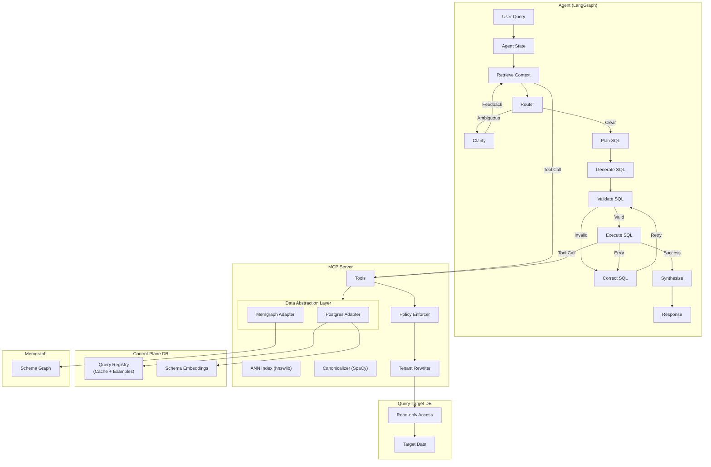

# Text2SQL

A natural language to SQL system that converts plain English queries into executable SQL. Built on **ANN-based Retrieval Augmented Generation (RAG)** and **Semantic Caching** for fast, accurate results.

## Core Capabilities

- **ANN Vector Search** — HNSW-based retrieval for schema linking and few-shot examples
- **Semantic Cache** — SpaCy-powered canonicalization for deterministic query matching
- **Graph-Aware RAG** — Memgraph integration for FK traversal and relational context
- **Multi-Tenant Security** — AST-based policy enforcement and RLS injection
- **MCP Protocol** — Extensible tool interface for any MCP-compliant agent
- **Multi-Platform Support** — Out-of-the-box support for Postgres, MySQL, Snowflake, BigQuery, Athena, Databricks, DuckDB, ClickHouse, and Redshift

## System Architecture



## Key Features

### ANN-Based RAG
- **Triple-Filter Schema Linking**: Structural backbone → Value spy → Semantic reranker
- **HNSW Vector Search**: Millisecond-latency retrieval via `hnswlib`
- **Enriched Embeddings**: Auto-generated descriptions for business domain semantics

### Semantic Caching
- **Signature Keys**: SpaCy-generated canonical identifiers for semantic deduplication
- **Pattern Discovery**: LLM-powered synonym generation (e.g., "active" → "live", "running")
- **Multi-Role Registry**: Single `query_pairs` table serves as cache, few-shot examples, and golden test cases
- **AST Verification**: Cache hits validated via SQL predicate matching

### Security & Extensibility
- **AST-Based Guards**: `sqlglot` enforces read-only access and tenant isolation
- **Dual-DB Architecture**: Optional separation of control-plane and query-target data
- **Provider Agnostic**: Supports OpenAI, Anthropic, and Google Gemini

## Quick Start

### Prerequisites
- Docker & Docker Compose
- Python 3.12+ (for local development)

### Setup

```bash
# Configure environment
cp .env.example .env

# Bootstrap local data directories
./scripts/dev/bootstrap_local_data.sh

# Start the full stack (Infrastructure + App + Observability)
make up
```

### Access Points

| Service | URL | Description |
|---------|-----|-------------|
| React UI | `http://localhost:3333` | Primary interface |
| MCP Server | `http://localhost:8000/messages` | Tool server (SSE) |
| OTEL Worker | `http://localhost:4320` | Trace API |
| Grafana | `http://localhost:3001` | Observability dashboards |
| Memgraph | `7687`, `7444`, `3000` | Graph database |

### React UI Environment

| Variable | Default | Description |
|----------|---------|-------------|
| `VITE_OTEL_WORKER_URL` | `http://localhost:4320` | OTEL Worker API |
| `VITE_AGENT_SERVICE_URL` | `http://localhost:8081` | Agent service |
| `VITE_UI_API_URL` | `http://localhost:8082` | UI API service |

### UI Diagnostics

Native SVG charts now provide hover tooltips via the ChartSchema renderers. Tooltips follow the cursor and use axis formatting when available.

Verbose / Diagnostic View is opt-in and trace-backed. Enable it in Agent Chat or Trace Detail (or use `?verbose=1`) to render intermediate agent steps derived from OTEL span attributes. Payloads may be truncated or redacted and are collapsed by default.

## Project Structure

```
text2sql/
├── ui/                     # React UI (Vite + TypeScript)
├── src/
│   ├── agent/              # LangGraph agent
│   ├── mcp_server/         # MCP server and tools
│   ├── dal/                # Data Abstraction Layer
│   ├── ingestion/          # Pattern ingestion
│   ├── otel_worker/        # Trace processor
│   └── evaluation/         # Eval runner and Airflow DAGs
├── tests/                  # Unit and integration tests
├── scripts/                # Dev and ops scripts
├── config/                 # Docker and service configs
└── data/database/          # SQL init scripts
```

## Development

### Hot Reload
Source code is bind-mounted for live updates:
- **React UI**: `ui/src/` → port 3333
- **MCP Server**: `src/mcp_server/`
- **OTEL Worker**: `src/otel_worker/`

Dependency changes require rebuild (`--build`).

### Cleanup

| Command | Action |
|---------|--------|
| `make docker-clean` | Stop containers, prune dangling images |
| `make docker-clean-deep` | Also prune unused images/cache |
| `make docker-nuke` | **Destructive**: Remove volumes and `./local-data` |

### Testing
```bash
# Unit tests
pytest tests/unit/

# Integration tests (requires running services)
docker compose -f docker-compose.test.yml up -d
pytest tests/integration/
```

Quick DAL-only sweep:
```bash
make test-dal
```
`make test-dal` uses `.venv/bin/python` when available to avoid `uv` cache instability. If you hit a `uv` cache error, run via a local cache directory:
```bash
uv run --cache-dir ./.uv-cache pytest tests/unit/dal -v
```

## Configuration

The system uses environment variables for configuration. See `.env.example` for a complete list of available options.

### Control-Plane vs. Query-Target
- **Control-Plane**: Always uses PostgreSQL to store query registries, embeddings, and metadata.
- **Query-Target**: The database you want to query. You can toggle this via `QUERY_TARGET_BACKEND`.

If the control-plane database is configured, query-target settings can also be managed from the UI (Settings → Query Target). The UI stores metadata and **secret references only**; secrets must remain in environment variables or an external secret manager. Activating a new query-target requires a backend restart and will show a pending status until the service boots successfully.

### Supported Backends
Switch between supported databases by setting `QUERY_TARGET_BACKEND` (e.g., `postgres`, `mysql`, `snowflake`, `bigquery`, `athena`, `databricks`, `duckdb`, `clickhouse`, `redshift`, `sqlite`).

Each backend requires specific environment variables for connection (e.g., `DB_HOST`, `SNOWFLAKE_ACCOUNT`, etc.). Refer to the Data Abstraction Layer (DAL) documentation or `.env.example` for specific credential requirements.

#### DuckDB Notes
- Use `DUCKDB_PATH=:memory:` for an in-memory database.
- Set `DUCKDB_READ_ONLY=true` to open a file-backed DuckDB database in read-only mode.

### DAL Feature Flags
- `DAL_EXPERIMENTAL_FEATURES=true` enables opt-in features like schema cache, error classification metadata, and display-only type normalization.
- `DAL_TRACE_QUERIES=true` emits DAL query spans with hashed SQL only (no raw SQL).
- `DAL_ALLOW_LOCAL_QUERY_TARGETS=true` allows UI-configured local providers (SQLite/DuckDB) in non-production environments.
- `DAL_SCHEMA_CACHE_MAX_ENTRIES=1000` caps schema cache entries (LRU eviction).
- `DAL_CLASSIFIED_ERROR_TELEMETRY=true` (default: true) emits structured logs and span events for classified DAL errors. Set `DAL_CLASSIFIED_ERROR_TELEMETRY=false` to disable. Guardrails: attributes are bounded cardinality and exclude raw SQL or user identifiers.
- `DAL_PROVIDER_AWARE_RETRY=true` (default: true) enables provider-aware retry classification for transient errors.

### Async Provider Guardrails
Async warehouses (Snowflake, BigQuery, Athena, Databricks) enforce timeouts and attempt cancellation on deadline. Configure provider-specific `*_QUERY_TIMEOUT_SECS` and `*_MAX_ROWS` in `.env.example`.

### Redshift Notes
Redshift query targets avoid explicit transaction wrappers; compatibility guardrails still apply.

### Postgres Cloud Notes
Managed Postgres variants (Aurora, RDS, Azure Database for PostgreSQL, Cloud SQL for PostgreSQL) work via `QUERY_TARGET_BACKEND=postgres`. Configure connectivity/TLS at the deployment layer; the DAL does not abstract vendor-specific SSL configuration.

### Observability
OTEL-based observability is mandatory for trace storage and debugging. The stack is automatically initialized during `make up`.

### Ops Runbook: Agent Remaining Hardening Pass
New environment flags introduced by the remaining hardening pass:
- `AGENT_SYNTHESIZE_TEMPERATURE` (float)
- `AGENT_SYNTHESIZE_MODE` (`deterministic` or unset)
- `AGENT_SCHEMA_DRIFT_HINTS` (default: true)
- `AGENT_SCHEMA_DRIFT_AUTO_REFRESH` (default: false)
- `AGENT_EMPTY_RESULT_SANITY_CHECK` (default: false)
- `AGENT_INTERACTION_PERSISTENCE_MODE` (`best_effort` default, `strict` optional)
- `AGENT_CACHE_SCHEMA_VALIDATION` (default: false)

Focused unit tests added in this pass can be run with:
```bash
python3 -m pytest tests/unit/agent/test_retrieve.py
python3 -m pytest tests/unit/agent/test_synthesize.py
python3 -m pytest tests/unit/agent/test_schema_drift.py
python3 -m pytest tests/unit/dal/test_async_cancel_contract.py
python3 -m pytest tests/unit/agent/test_empty_results.py
python3 -m pytest tests/unit/agent/test_persistence_modes.py
python3 -m pytest tests/unit/agent/test_retry_observability.py
```

### Ops Runbook: Agent P2 Hardening Pass
New environment flags introduced by the P2 hardening pass:
- `AGENT_SCHEMA_DRIFT_AUTO_REFRESH_MODE` (`off` default, `once` optional)
- `AGENT_DRIFT_CANARY_ENABLED` (default: false)
No additional flags are required for pagination; capability gating is automatic.

Pagination and completeness notes:
- `page_size` is capped at 1000 by the MCP tool.
- Providers without pagination support fail fast with `unsupported_capability`.
- `result_completeness.partial_reason` values are bounded: `TRUNCATED|LIMITED|PAGINATED|PROVIDER_CAP|UNKNOWN`.
- `result_completeness.next_page_token` is opaque and should be passed back verbatim.

Troubleshooting:
- If `unsupported_capability`, verify provider support and remove pagination/column-metadata options.
- If `partial_reason=PROVIDER_CAP`, consider narrowing filters or enabling pagination (where supported).
- If `next_page_token` is missing but expected, confirm provider pagination support and page size bounds.

Focused unit tests added in this pass can be run with:
```bash
python3 -m pytest tests/unit/agent/test_result_completeness.py
python3 -m pytest tests/unit/mcp_server/test_execute_sql_pagination.py
python3 -m pytest tests/unit/dal/test_pagination_tokens.py
python3 -m pytest tests/unit/agent/test_schema_drift_active.py
python3 -m pytest tests/unit/dal/test_cancel_matrix.py
python3 -m pytest tests/unit/agent/test_synthesis_completeness_disclosures.py
python3 -m pytest tests/unit/agent/test_drift_canary.py
```
