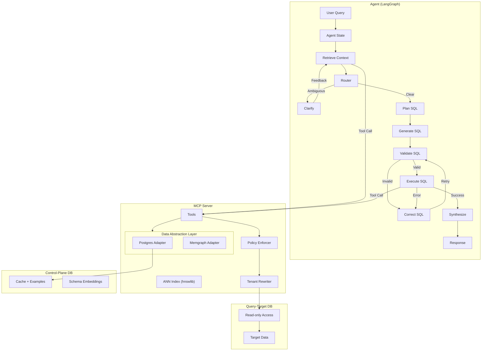

# Text2SQL

A production-grade natural language to SQL system that converts plain English queries into executable SQL. Built on **ANN-based Retrieval Augmented Generation (RAG)** and **Semantic Caching** for fast, accurate, and resilient results across diverse database backends.

## Core Capabilities

- **ANN Vector Search** — HNSW-based retrieval for high-precision schema linking and few-shot examples.
- **Semantic Cache** — SpaCy-powered canonicalization for deterministic query matching and deduplication.
- **Graph-Aware RAG** — Memgraph integration for deep FK traversal and relational schema context.
- **Multi-Tenant Security** — AST-based policy enforcement and RLS injection via `sqlglot`.
- **Operational Resilience** — Bounded auto-pagination, next-page prefetch, and adaptive retry policies.
- **Reproducibility** — Record and replay agent runs with deterministic tool-playback bundles.

## System Architecture



## Quick Start

### Setup
```bash
cp .env.example .env  # Configure credentials
./scripts/dev/bootstrap_local_data.sh
make up               # Start Infre + App + Observability
```

### Access Points
| Service | URL | Description |
|---------|-----|-------------|
| React UI | `http://localhost:3333` | Primary operator interface |
| MCP Server | `http://localhost:8000` | Tool server (SSE) |
| Grafana | `http://localhost:3001` | Dashboards & Trace analytics |

## Configuration & Guardrails

### Control-Plane vs. Query-Target
The system separates its own metadata (**Control-Plane** in PostgreSQL) from the data you want to query (**Query-Target**). Supported targets include Postgres, MySQL, Snowflake, BigQuery, Athena, Databricks, DuckDB, ClickHouse, Redshift, and SQLite. Configure the target via `QUERY_TARGET_BACKEND`.

### Async Provider Guardrails
For warehouse-scale providers (Snowflake, BigQuery, etc.), the system enforces strict timeout-aware execution and attempts background cancellation on the database side if the agent deadline is exceeded.

## Operational Resilience & Observability (Summary)

### Resilience & Pagination
The system is designed for high availability and large result sets:
- **Adaptive Retries**: Classifies errors (transient vs. semantic) and uses EMA latency + remaining budget to decide whether to retry.
- **Auto-Pagination**: Automatically loops through results for providers with row caps, bounded by max pages/rows.
- **Next-Page Prefetch**: Opportunistically fetches subsequent results in the background to reduce perceived latency.

### Hardening & Schema Drift
- **Schema Freshness**: Automatically detects suspected schema drift (e.g., missing columns) and can trigger guarded context refreshes.
- **Validation**: Enforces multi-layer validation, including AST security checks, schema-bound type validation, and correction similarity guards.

### Reproducibility & Troubleshooting
- **Replay Bundles**: Can record entire agent runs into redacted, deterministic JSON bundles. These can be replayed "offline" (mocking tool outputs) to debug agent logic without live database dependencies.
- **Transparency**: Every decision—from capability fallback to retry budget checks—is recorded in structured trace attributes and surfaced in the Operator UI panels.
- **Telemetry**: Full OTEL integration provides end-to-end tracing across the agent graph, MCP tools, and DAL adapters.

## Development & Testing
- **Hot Reload**: Bind-mounted source for UI and MCP servers.
- **Cleanup**: Use `make docker-clean` or `make docker-nuke` for environment resets.
- **Testing**: Run unit tests via `pytest tests/unit/` and integration tests via `docker compose -f docker-compose.test.yml up`.
- **OTEL Unit Tests**: Unit tests default to `OTEL_TEST_EXPORTER=in_memory` so OTEL coverage runs without a live collector.
- **Explicit OTEL Skip Switch**: Set `SKIP_OTEL_WORKER_TESTS=1` only when you intentionally need to bypass OTEL-worker-specific unit tests.
- **Live OTEL Smoke Test**: Set `ENABLE_OTEL_SMOKE_TEST=true` (and point `OTEL_WORKER_URL`) to run the real worker ingestion smoke test.
- **Strict Runtime Mode**: Set `OTEL_WORKER_REQUIRED=true` to fail fast if OTEL exporter initialization fails.
