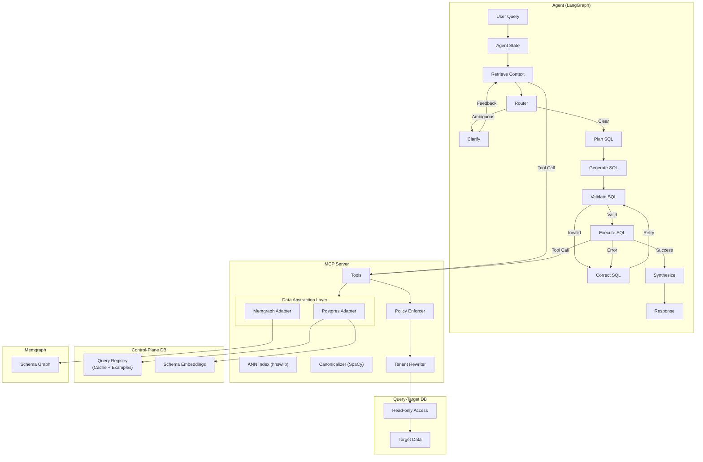

# Text2SQL

A natural language to SQL system that converts plain English queries into executable SQL. Built on **ANN-based Retrieval Augmented Generation (RAG)** and **Semantic Caching** for fast, accurate results.

## Core Capabilities

- **ANN Vector Search** — HNSW-based retrieval for schema linking and few-shot examples
- **Semantic Cache** — SpaCy-powered canonicalization for deterministic query matching
- **Graph-Aware RAG** — Memgraph integration for FK traversal and relational context
- **Multi-Tenant Security** — AST-based policy enforcement and RLS injection
- **MCP Protocol** — Extensible tool interface for any MCP-compliant agent

## System Architecture



## Key Features

### ANN-Based RAG
- **Triple-Filter Schema Linking**: Structural backbone → Value spy → Semantic reranker
- **HNSW Vector Search**: Millisecond-latency retrieval via `hnswlib`
- **Enriched Embeddings**: Auto-generated descriptions for business domain semantics

### Semantic Caching
- **Signature Keys**: SpaCy-generated canonical identifiers for semantic deduplication
- **Pattern Discovery**: LLM-powered synonym generation (e.g., "active" → "live", "running")
- **Multi-Role Registry**: Single `query_pairs` table serves as cache, few-shot examples, and golden test cases
- **AST Verification**: Cache hits validated via SQL predicate matching

### Security & Extensibility
- **AST-Based Guards**: `sqlglot` enforces read-only access and tenant isolation
- **Dual-DB Architecture**: Optional separation of control-plane and query-target data
- **Provider Agnostic**: Supports OpenAI, Anthropic, and Google Gemini

## Quick Start

### Prerequisites
- Docker & Docker Compose
- Python 3.12+ (for local development)

### Setup

```bash
# Configure environment
cp .env.example .env

# Bootstrap local data directories
./scripts/dev/bootstrap_local_data.sh

# Start the full stack (Infrastructure + App + Observability)
make up
```

### Access Points

| Service | URL | Description |
|---------|-----|-------------|
| React UI | `http://localhost:3333` | Primary interface |
| MCP Server | `http://localhost:8000/messages` | Tool server (SSE) |
| OTEL Worker | `http://localhost:4320` | Trace API |
| Grafana | `http://localhost:3001` | Observability dashboards |
| Memgraph | `7687`, `7444`, `3000` | Graph database |

### React UI Environment

| Variable | Default | Description |
|----------|---------|-------------|
| `VITE_OTEL_WORKER_URL` | `http://localhost:4320` | OTEL Worker API |
| `VITE_AGENT_SERVICE_URL` | `http://localhost:8081` | Agent service |
| `VITE_UI_API_URL` | `http://localhost:8082` | UI API service |

## Project Structure

```
text2sql/
├── ui/                     # React UI (Vite + TypeScript)
├── src/
│   ├── agent/              # LangGraph agent
│   ├── mcp_server/         # MCP server and tools
│   ├── dal/                # Data Abstraction Layer
│   ├── ingestion/          # Pattern ingestion
│   ├── otel_worker/        # Trace processor
│   └── evaluation/         # Eval runner and Airflow DAGs
├── tests/                  # Unit and integration tests
├── scripts/                # Dev and ops scripts
├── config/                 # Docker and service configs
└── data/database/          # SQL init scripts
```

## Development

### Hot Reload
Source code is bind-mounted for live updates:
- **React UI**: `ui/src/` → port 3333
- **MCP Server**: `src/mcp_server/`
- **OTEL Worker**: `src/otel_worker/`

Dependency changes require rebuild (`--build`).

### Cleanup

| Command | Action |
|---------|--------|
| `make docker-clean` | Stop containers, prune dangling images |
| `make docker-clean-deep` | Also prune unused images/cache |
| `make docker-nuke` | **Destructive**: Remove volumes and `./local-data` |

### Testing
```bash
# Unit tests
pytest tests/unit/

# Integration tests (requires running services)
docker compose -f docker-compose.test.yml up -d
pytest tests/integration/
```

## Configuration

### Control-Plane Isolation
Disabled by default. Enable with `DB_ISOLATION_ENABLED=true` and configure `CONTROL_DB_*` variables.

### Provider Selectors
Optional overrides for storage backends:
- `GRAPH_STORE_PROVIDER` — defaults to Memgraph
- `CACHE_STORE_PROVIDER` — defaults to Postgres

### Observability
**OTEL is mandatory.** MLflow support has been deprecated. The observability stack (`otel-collector`, `otel-worker`, `grafana`) is required for trace storage, metrics, and debugging. It is automatically included in `make up`.
