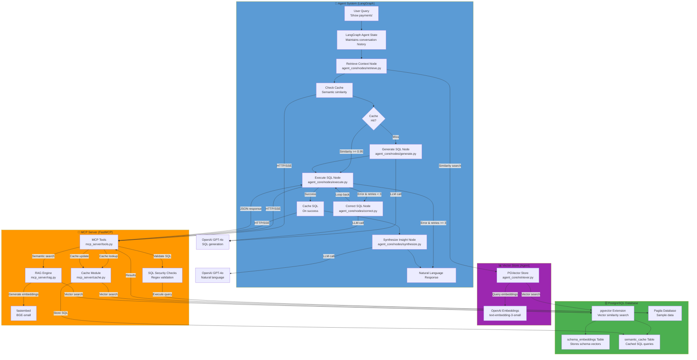

# Text 2 SQL

A natural language interface that enables users to query databases using plain English. The system uses AI to understand questions, retrieve relevant schema information, and generate accurate SQL queries automatically.

## Overview

This project demonstrates an intelligent database query system that bridges the gap between natural language and SQL. Users can ask questions in plain English, and the system automatically:

- Understands the intent behind questions
- Finds relevant database tables and schemas
- Generates and executes SQL queries
- Returns results in a user-friendly format

The system is designed with security and scalability in mind, using modern containerization and secure access patterns.

## Architecture

The system follows a decoupled architecture where the AI reasoning engine communicates with the database through a standardized interface. This design ensures:

- **Vendor Agnostic**: Works with PostgreSQL, Snowflake, Databricks, and other databases
- **Secure**: Multi-layered security with read-only access and application-level safeguards
- **Intelligent**: Uses semantic search to find relevant schema information automatically

The system uses Docker to orchestrate services including PostgreSQL with vector search capabilities and a Python-based server that provides secure database access tools.

### System Flow



**Key Components:**

- **Agent System**: LangGraph workflow orchestrates the reasoning loop with 5 nodes (retrieve, generate, execute, correct, synthesize)
- **MCP Server**: FastMCP-based server provides secure database access tools with RAG capabilities
- **Vector Store**: Dual-purpose - Agent uses PGVector for context retrieval, MCP Server uses fastembed for semantic search
- **Security Layer**: SQL validation happens in MCP Server before database execution
- **Self-Correction Loop**: Agent automatically retries failed queries up to 3 times
- **Dynamic Few-Shot Learning**: Retrieves relevant SQL examples based on semantic similarity to improve generation accuracy
- **Semantic Caching**: Caches successful SQL queries using vector similarity (threshold 0.95) to reduce latency and LLM API costs

## Quick Start

### Prerequisites
- Docker and Docker Compose
- Python 3.12+ (for local development)
- MCP client (e.g., Claude Desktop, or `@modelcontextprotocol/inspector`)
- Streamlit (for web UI - optional)

### Setup

1. **Clone the repository**
   ```bash
   cd text2sql
   ```

2. **Download database files**
   ```bash
   ./database/init-scripts/download_data.sh
   ```

3. **Start services**
   ```bash
   docker compose up --build
   ```

4. **Test the system**
   ```bash
   npx @modelcontextprotocol/inspector
   # Connect to: http://localhost:8000/sse
   ```

5. **Run Streamlit Web UI (Optional)**
   ```bash
   # Install Streamlit if not already installed
   pip install streamlit>=1.28.0

   # Run the Streamlit application
   streamlit run streamlit/app.py
   # Open http://localhost:8501 in your browser
   ```

## Features

The system provides seven core capabilities:

1. **Table Discovery**: Find available tables with optional search
2. **Schema Inspection**: Get detailed table structures, columns, and relationships
3. **Query Execution**: Run read-only SQL queries with automatic safety checks
4. **Business Metrics**: Access predefined business metric definitions
5. **Semantic Search**: Find relevant tables using natural language queries
6. **Dynamic Few-Shot Learning**: Automatically retrieves relevant SQL examples to improve query generation accuracy
7. **Semantic Caching**: Caches successful SQL queries to reduce latency and API costs for recurring queries

The semantic search feature uses vector embeddings to understand query intent and automatically retrieve the most relevant database schemas, solving the challenge of context window limitations.

### Web Interface

A Streamlit web application provides an intuitive UI for interacting with the agent:
- Natural language question interface
- Real-time SQL query generation and execution
- Formatted result tables with syntax highlighting
- Conversation history tracking
- Cache hit indicators
- Tenant ID configuration for multi-tenant scenarios

See [Streamlit Application Guide](docs/streamlit-application-guide.md) for detailed setup and usage instructions.

## Security

- **Read-Only Access**: Database connections use restricted privileges (SELECT only)
- **Application-Level Gates**: Automatic rejection of potentially dangerous SQL operations
- **Container Isolation**: Services run in isolated containers with controlled network access
- **Error Sanitization**: Error messages exclude sensitive information

## Project Structure

```
text2sql/
├── docker-compose.yml          # Service orchestration
├── agent/                      # AI agent implementation
│   ├── src/agent_core/         # Agent package (LangGraph workflow)
│   │   ├── nodes/              # Workflow nodes (retrieve, generate, execute, correct, synthesize)
│   │   ├── graph.py            # LangGraph workflow definition
│   │   ├── state.py            # Agent state structure
│   │   ├── retriever.py        # Vector store initialization
│   │   └── tools.py            # MCP server integration
│   └── tests/                  # Agent unit tests
├── mcp-server/                 # Database access server
│   ├── src/mcp_server/         # Server package
│   └── tests/                  # Server unit tests
├── streamlit/                  # Streamlit web application
│   ├── app_logic.py            # Testable business logic
│   ├── app.py                  # Streamlit UI layer
│   ├── tests/                  # Streamlit unit tests
│   └── .streamlit/             # Streamlit configuration
└── database/                   # Database initialization scripts
```

## Testing

The project includes comprehensive unit tests with 100% coverage for core modules.

**Run all tests:**
```bash
pytest -m "not integration"
```

**Run with coverage:**
```bash
pytest --cov=mcp-server/src/mcp_server --cov=agent/src/agent_core --cov=streamlit/app_logic --cov-report=term-missing
```

**Test Coverage:**
- MCP Server: 100% coverage across all modules (94+ tests)
- Agent: 100% coverage for state management, nodes, and workflow (50+ tests)
- Streamlit: 100% coverage on business logic (11 tests)

**Verify agent workflow:**
```bash
python3 -c "from agent_core.graph import app; print('Nodes:', list(app.nodes.keys()))"
```

## Code Quality

Pre-commit hooks enforce code formatting and quality standards. Run hooks manually:

```bash
python3 -m pre_commit run --all-files
```

**Configured checks:**
- Python formatting (Black, isort)
- Linting (flake8)
- File validation (YAML, JSON, TOML)
- Test collection validation

## Development Workflow

1. Make code changes
2. Run pre-commit hooks: `python3 -m pre_commit run --all-files`
3. Run tests: `pytest --import-mode=importlib`
4. Verify all checks pass before committing

## CI/CD

GitHub Actions workflows automatically:
- Run linting and formatting checks
- Build and validate Docker images
- Execute test suites
- Scan for security vulnerabilities
- Update dependencies via Dependabot
