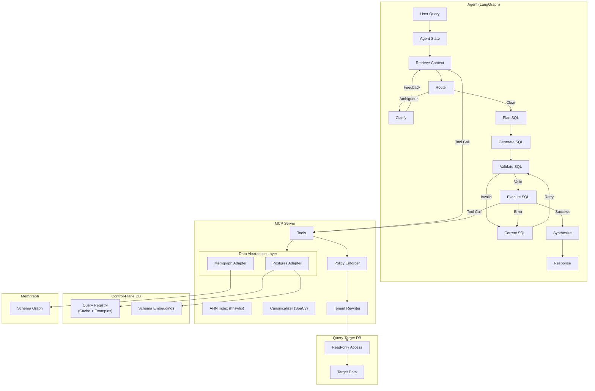

# Text2SQL

A natural language to SQL system that converts plain English queries into executable SQL. Built on **ANN-based Retrieval Augmented Generation (RAG)** and **Semantic Caching** for fast, accurate results.

## Core Capabilities

- **ANN Vector Search** — HNSW-based retrieval for schema linking and few-shot examples
- **Semantic Cache** — SpaCy-powered canonicalization for deterministic query matching
- **Graph-Aware RAG** — Memgraph integration for FK traversal and relational context
- **Multi-Tenant Security** — AST-based policy enforcement and RLS injection
- **MCP Protocol** — Extensible tool interface for any MCP-compliant agent

## System Architecture



## Key Features

### ANN-Based RAG
- **Triple-Filter Schema Linking**: Structural backbone → Value spy → Semantic reranker
- **HNSW Vector Search**: Millisecond-latency retrieval via `hnswlib`
- **Enriched Embeddings**: Auto-generated descriptions for business domain semantics

### Semantic Caching
- **Signature Keys**: SpaCy-generated canonical identifiers for semantic deduplication
- **Pattern Discovery**: LLM-powered synonym generation (e.g., "active" → "live", "running")
- **Multi-Role Registry**: Single `query_pairs` table serves as cache, few-shot examples, and golden test cases
- **AST Verification**: Cache hits validated via SQL predicate matching

### Security & Extensibility
- **AST-Based Guards**: `sqlglot` enforces read-only access and tenant isolation
- **Dual-DB Architecture**: Optional separation of control-plane and query-target data
- **Provider Agnostic**: Supports OpenAI, Anthropic, and Google Gemini

## Quick Start

### Prerequisites
- Docker & Docker Compose
- Python 3.12+ (for local development)

### Setup

```bash
# Configure environment
cp .env.example .env

# Bootstrap local data directories
./scripts/dev/bootstrap_local_data.sh

# Start the full stack (Infrastructure + App + Observability)
make up
```

### Access Points

| Service | URL | Description |
|---------|-----|-------------|
| React UI | `http://localhost:3333` | Primary interface |
| MCP Server | `http://localhost:8000/messages` | Tool server (SSE) |
| OTEL Worker | `http://localhost:4320` | Trace API |
| Grafana | `http://localhost:3001` | Observability dashboards |
| Memgraph | `7687`, `7444`, `3000` | Graph database |

### React UI Environment

| Variable | Default | Description |
|----------|---------|-------------|
| `VITE_OTEL_WORKER_URL` | `http://localhost:4320` | OTEL Worker API |
| `VITE_AGENT_SERVICE_URL` | `http://localhost:8081` | Agent service |
| `VITE_UI_API_URL` | `http://localhost:8082` | UI API service |

## Project Structure

```
text2sql/
├── ui/                     # React UI (Vite + TypeScript)
├── src/
│   ├── agent/              # LangGraph agent
│   ├── mcp_server/         # MCP server and tools
│   ├── dal/                # Data Abstraction Layer
│   ├── ingestion/          # Pattern ingestion
│   ├── otel_worker/        # Trace processor
│   └── evaluation/         # Eval runner and Airflow DAGs
├── tests/                  # Unit and integration tests
├── scripts/                # Dev and ops scripts
├── config/                 # Docker and service configs
└── data/database/          # SQL init scripts
```

## Development

### Hot Reload
Source code is bind-mounted for live updates:
- **React UI**: `ui/src/` → port 3333
- **MCP Server**: `src/mcp_server/`
- **OTEL Worker**: `src/otel_worker/`

Dependency changes require rebuild (`--build`).

### Cleanup

| Command | Action |
|---------|--------|
| `make docker-clean` | Stop containers, prune dangling images |
| `make docker-clean-deep` | Also prune unused images/cache |
| `make docker-nuke` | **Destructive**: Remove volumes and `./local-data` |

### Testing
```bash
# Unit tests
pytest tests/unit/

# Integration tests (requires running services)
docker compose -f docker-compose.test.yml up -d
pytest tests/integration/
```

## Configuration

### Control-Plane Isolation
Disabled by default. Enable with `DB_ISOLATION_ENABLED=true` and configure `CONTROL_DB_*` variables.

### SQLite Query Target (Dev/Test Only)
Use SQLite as the query-target database for local development or tests. The control plane
remains Postgres-only.

```bash
QUERY_TARGET_BACKEND=sqlite
SQLITE_DB_PATH=./local-data/query-target.sqlite
```

Limitations:
- No pgvector / semantic cache support
- Limited concurrency (SQLite)
- Intended for dev/test only (not production)

### MySQL/MariaDB Query Target (Dev/Test Only)
Use MySQL/MariaDB as the query-target database. The control plane remains Postgres-only.

```bash
QUERY_TARGET_BACKEND=mysql
DB_HOST=localhost
DB_PORT=3306
DB_NAME=query_target
DB_USER=root
DB_PASS=secret
```

Limitations:
- No pgvector / semantic cache support
- No RLS or session-level tenant enforcement
- Identifier quoting uses backticks; case sensitivity depends on server configuration
- Intended for dev/test only (not production)

### Snowflake Query Target (Credential-Gated)
Use Snowflake as the query-target database. The control plane remains Postgres-only.

```bash
QUERY_TARGET_BACKEND=snowflake
SNOWFLAKE_ACCOUNT=your_account
SNOWFLAKE_USER=your_user
SNOWFLAKE_PASSWORD=your_password  # or SNOWFLAKE_AUTHENTICATOR
SNOWFLAKE_WAREHOUSE=compute_wh
SNOWFLAKE_DATABASE=ANALYTICS
SNOWFLAKE_SCHEMA=PUBLIC
SNOWFLAKE_ROLE=read_only_role
SNOWFLAKE_QUERY_TIMEOUT_SECS=30
SNOWFLAKE_POLL_INTERVAL_SECS=1
SNOWFLAKE_MAX_ROWS=1000
SNOWFLAKE_WARN_AFTER_SECS=10
```

Limitations:
- Async/job-style execution with client-side polling
- Results are capped by `SNOWFLAKE_MAX_ROWS`; add LIMIT clauses
- Foreign key metadata is best-effort via INFORMATION_SCHEMA
- Intended for dev/test only (not production)

Integration tests (requires credentials):
```bash
uv run pytest tests/integration/dal/test_snowflake_query_target_e2e.py -v
```

### BigQuery Query Target (Async)
Use BigQuery as the query-target database. The control plane remains Postgres-only.

```bash
QUERY_TARGET_BACKEND=bigquery
BIGQUERY_PROJECT=your-project
BIGQUERY_DATASET=your_dataset
BIGQUERY_LOCATION=us-central1
BIGQUERY_QUERY_TIMEOUT_SECS=30
BIGQUERY_POLL_INTERVAL_SECS=1
BIGQUERY_MAX_ROWS=1000
```

Notes:
- Requires Google Application Default Credentials (GOOGLE_APPLICATION_CREDENTIALS or default ADC)
- Install `google-cloud-bigquery` in your environment for BigQuery support
- Introspection is scoped to the configured dataset
- Foreign keys are not enforced or surfaced

### Athena Query Target (Async)
Use AWS Athena as the query-target database. The control plane remains Postgres-only.

```bash
QUERY_TARGET_BACKEND=athena
AWS_REGION=us-east-1
ATHENA_WORKGROUP=primary
ATHENA_OUTPUT_LOCATION=s3://your-bucket/athena-results/
ATHENA_DATABASE=default
ATHENA_QUERY_TIMEOUT_SECS=30
ATHENA_POLL_INTERVAL_SECS=1
ATHENA_MAX_ROWS=1000
```

Notes:
- Requires AWS credentials via the default AWS SDK chain
- Install `boto3` in your environment for Athena support
- Output location is mandatory for Athena query execution

### Databricks SQL Warehouse Query Target (Async, Unity Catalog)
Use Databricks SQL Warehouses as the query-target database. The control plane remains Postgres-only.

```bash
QUERY_TARGET_BACKEND=databricks
DATABRICKS_HOST=https://your-workspace.cloud.databricks.com
DATABRICKS_TOKEN=your_token
DATABRICKS_WAREHOUSE_ID=warehouse_id
DATABRICKS_CATALOG=main
DATABRICKS_SCHEMA=public
DATABRICKS_QUERY_TIMEOUT_SECS=30
DATABRICKS_POLL_INTERVAL_SECS=1
DATABRICKS_MAX_ROWS=1000
```

Notes:
- Unity Catalog is required for schema introspection (system.information_schema)
- Uses the Statement Execution API (no legacy Hive metastore support)

### Redshift Query Target (Sync, Postgres-Compatible)
Use Amazon Redshift as the query-target database. The control plane remains Postgres-only.

```bash
QUERY_TARGET_BACKEND=redshift
DB_HOST=redshift-cluster.endpoint.amazonaws.com
DB_PORT=5439
DB_NAME=dev
DB_USER=awsuser
DB_PASS=your_password
```

Limitations:
- Arrays and JSONB operators/functions are blocked by a pre-execution validator
- Foreign keys are informational only in Redshift
- Read-only semantics only; no tenant RLS hooks

Manual smoke test:
```bash
uv run python scripts/dev/redshift_query_target_smoke.py
```

### Provider Selectors
Optional overrides for storage backends:
- `GRAPH_STORE_PROVIDER` — defaults to Memgraph
- `CACHE_STORE_PROVIDER` — defaults to Postgres

### P2 Query Targets Summary
| Provider | Execution Model | Namespace | Notes |
|---------|-----------------|-----------|-------|
| BigQuery | Async | project.dataset.table | Requires ADC; max rows/timeout guardrails |
| Athena | Async | database.table | Requires S3 output location; max rows/timeout guardrails |
| Databricks | Async | catalog.schema.table | Unity Catalog required for introspection |

### Observability
**OTEL is mandatory.** MLflow support has been deprecated. The observability stack (`otel-collector`, `otel-worker`, `grafana`) is required for trace storage, metrics, and debugging. It is automatically included in `make up`.
