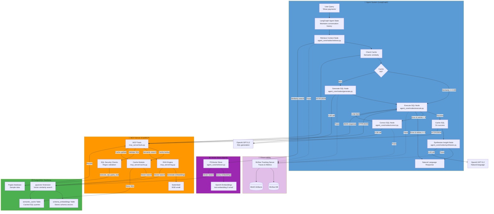

# Text 2 SQL

A natural language interface that enables users to query databases using plain English. This project demonstrates an intelligent system that bridges the gap between natural language and SQL.

The system automatically:
*   **Understands intent**: Deciphers the meaning behind user questions.
*   **Retrieves context**: Finds relevant database tables and schemas.
*   **Executes securely**: Generates and runs SQL queries with built-in safety checks.
*   **Formats results**: Returns data in a clear, user-friendly format.

Designed for security and scalability, it uses modern containerization and secure access patterns to ensure robust performance.

## System Flow



## Core Features

*   **Multi-Provider LLM Support**: Switch between OpenAI, Anthropic (Claude), and Google (Gemini) via UI or environment variables.
*   **Intelligent Query Generation**: Uses a LangGraph-orchestrated reasoning loop (Retrieve → Generate → Execute → Correct → Synthesize) to ensure accuracy.
*   **Secure Access**: Built on the Model Context Protocol (MCP) server, enforcing read-only permissions and SQL safety checks.
*   **RAG & Semantic Search**: Uses `pgvector` and `fastembed` to dynamically find relevant tables and few-shot examples based on the user's question.
*   **Self-Correction**: Automatically detects SQL errors and retries generation with error context up to 3 times.
*   **Performance Caching**: Semantic caching stores successful query patterns to reduce latency and API costs.
*   **Full Observability**: Integrated MLflow tracing provides end-to-end visibility into the agent's reasoning steps and performance metrics.

## Project Structure

```text
text2sql/
├── agent/                      # LangGraph AI agent
│   ├── src/agent_core/         # Core logic (nodes, graph, state)
│   ├── tests/                  # Unit tests (mocked)
│   └── tests_integration/      # Live integration tests
├── mcp-server/                 # Database access tools (FastMCP)
│   ├── src/mcp_server/         # Server implementation
│   ├── tests/                  # Unit tests
│   └── tests_integration/      # RLS & database integration tests
├── streamlit/                  # Web interface
├── database/                   # Init scripts & schema
└── docker-compose.yml          # Service orchestration
```

## Quick Start

### Prerequisites
*   Docker & Docker Compose
*   Python 3.12+ (for local development)

### Setup & Run

1.  **Initialize Data**: Download the Pagila sample database.
    ```bash
    ./database/init-scripts/download_data.sh
    ```

2.  **Configure Environment** (optional): Set your preferred LLM provider in `.env`:
    ```bash
    LLM_PROVIDER=openai      # Options: openai, anthropic, google
    LLM_MODEL=gpt-5.2        # Or: claude-sonnet-4-20250514, gemini-2.5-flash-preview-05-20
    ANTHROPIC_API_KEY=...    # Required for Anthropic
    GOOGLE_API_KEY=...       # Required for Google
    ```

3.  **Start Services**: Build and launch the container cluster.
    ```bash
    docker compose up -d --build
    ```

### Access Points

| Service | URL | Description |
|---------|-----|-------------|
| **Web UI** | `http://localhost:8501` | Streamlit interface for end-users |
| **MCP Server** | `http://localhost:8000/sse` | Tool server for the agent |
| **MLflow UI** | `http://localhost:5001` | Traces and metrics dashboard |
| **MinIO** | `http://localhost:9001` | S3-compatible artifact store |

## Testing

Run the isolated unit test suite (no Docker required):
```bash
pytest agent/tests mcp-server/tests
```
