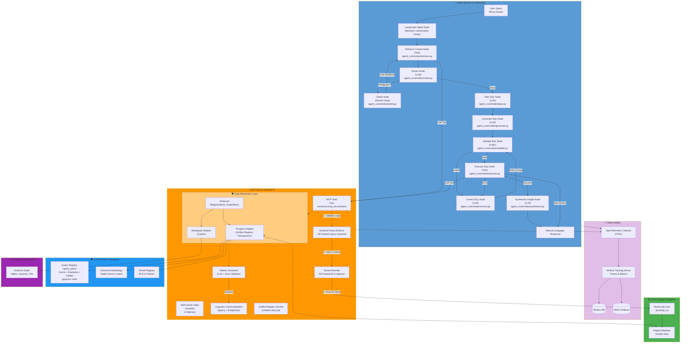

# Text 2 SQL

A natural language interface that enables users to query databases using plain English. This project demonstrates an intelligent system that bridges the gap between natural language and SQL.

The system automatically:
*   **Understands intent**: Deciphers the meaning behind user questions.
*   **Retrieves context**: Finds relevant database tables and schemas.
*   **Executes securely**: Generates and runs SQL queries with built-in safety checks.
*   **Formats results**: Returns data in a clear, user-friendly format.

Designed for security and scalability, it uses modern containerization and secure access patterns to ensure robust performance.

## System Flow




## Key Features & Architecture

### 🔍 Approximate Nearest Neighbors (ANN) Based Retrieval Augmented Generation (RAG)
*   **Dense Schema Linking**: Uses a **Triple-Filter Strategy** (Structural Backbone, Value Spy, Semantic Reranker) to intelligently prune relevant tables and columns, resolving "Context Starvation".
*   **Scalable Vector Search**: Implements **HNSW (Hierarchical Navigable Small Worlds)** via `hnswlib` for millisecond-latency search across schema embeddings and few-shot examples.
*   **Graph-Aware RAG**: Integrates Memgraph to traverse database relationships (Foreign Keys), ensuring retrieved contexts maintain relational integrity.
*   **Enriched Ingestion**: Automatically generates high-fidelity descriptions and embeddings during seeding, ensuring the agent understands business domain semantics.

### 🚀 Unified NLQ↔SQL Registry & Semantic Caching
*   **Canonical Identifiers**: Every query pair is anchored by a **SpaCy-generated signature key**, ensuring that semantically identical questions share a single source of truth.
*   **Automated Pattern Discovery**: A dedicated **Pattern Generation Agent** introspects the database and uses an LLM to generate colloquial synonyms for domain-specific values (e.g., "active" → "live", "running"), normalized and validated before being compiled into the SpaCy EntityRuler.
*   **Multi-Role Lifecycle**: A single entry in the `query_pairs` registry can serve multiple roles:
    *   **Cache**: Fast runtime lookups for repeating queries.
    *   **Example**: High-quality few-shot examples for LLM guidance.
    *   **Golden**: Verified test cases for evaluation and regression testing.
*   **Trust Levels**: Clear distinction between `verified` human-curated data and `autogenerated` machine results.
*   **Deterministic Guardrails**: Cache hits are cross-verified via AST parsing to ensure SQL predicates match user intent.

### 🛡️ Extensible Foundation: Multi-Provider LLM & Multi-Engine Database Support
*   **Extensible Tooling**: Built on the **Model Context Protocol (MCP)**, making database tools accessible to any MCP-compliant agent or client.
*   **Data Abstraction Layer (DAL)**: Decouples business logic from storage with strict interfaces (`RegistryStore`, `GraphStore`), allowing the system to easily extend to other database types (e.g., MySQL, Snowflake).
*   **Runtime Policy Enforcement**: Uses a **Dual-Database Architecture** to separate sensitive control-plane data (tenants, keys, registry) from the query-target data.
*   **AST-Based Security**: Employs `sqlglot` for AST traversal to strictly enforce read-only access and inject tenant isolation predicates at runtime.
*   **Provider Agnostic**: Seamlessly switch between OpenAI, Anthropic, and Google Gemini via a unified LLM client factory.

### 📡 Observability & Performance
*   **OpenTelemetry Integration**: Standardized tracing via OpenTelemetry (OTEL), ensuring vendor-neutral observability that exports seamlessly to MLflow or other APM backends.
*   **End-to-End Tracing**: Integrated MLflow connection provides full visibility into the agent's reasoning steps, tool calls, and registry decisions.
*   **Unified Monitoring**: Captures signature hits, misses, and guardrail rejections as structured metadata in the trace.

## Project Structure

```text
text2sql/
├── agent/                      # LangGraph AI agent
│   ├── src/agent_core/         # Core logic (nodes, graph, state)
│   ├── tests/                  # Unit tests (Mocked)
│   └── scripts/                # Evaluation & maintenance scripts
├── mcp-server/                 # Database access tools (FastMCP)
│   ├── src/mcp_server/         # Server implementation
│   │   ├── dal/                # Data Abstraction Layer (Interfaces & Adapters)
│   │   ├── services/           # Schema linking, indexing, and caching
│   │   └── tools/              # MCP Tool definitions
├── database/                   # Seed assets
│   ├── query-target/           # Target DB schema, data, and patterns
│   └── control-plane/          # App metadata, RLS, and cache schema
├── streamlit/                  # Web interface
└── docker-compose.yml          # Service orchestration
```

## Quick Start

### Prerequisites
*   Docker & Docker Compose
*   Python 3.12+ (for local development)

### Setup & Run

1.  **Initialize Data**: Generate pattern files and prepare the environment.
    ```bash
    ./scripts/seed_graph.sh
    ```

2.  **Configure Environment**: Set your API keys in `.env`:
    ```bash
    OPENAI_API_KEY=your_key
    LLM_PROVIDER=openai      # Options: openai, anthropic, google
    LLM_MODEL=gpt-5.2        # Or: claude-sonnet-4-20250514, gemini-2.5-pro-preview-05-06
    ```

3.  **Start Services**:
    ```bash
    docker compose up -d --build
    ```

### Access Points

| Service | URL | Description |
|---------|-----|-------------|
| **Web UI** | `http://localhost:8501` | Streamlit interface |
| **MCP Server** | `http://localhost:8000/mcp` | FastMCP tool server |
| **MLflow UI** | `http://localhost:5001` | Traces and metrics |
| **MinIO** | `http://localhost:9001` | Artifact storage (user: minioadmin / pass: minioadmin) |

## Testing

Run the full suite:
```bash
pytest agent/tests mcp-server/tests
```
