# Text 2 SQL

A natural language interface that enables users to query databases using plain English. This project demonstrates an intelligent system that bridges the gap between natural language and SQL.

The system automatically:
*   **Understands intent**: Deciphers the meaning behind user questions.
*   **Retrieves context**: Finds relevant database tables and schemas.
*   **Executes securely**: Generates and runs SQL queries with built-in safety checks.
*   **Formats results**: Returns data in a clear, user-friendly format.

Designed for security and scalability, it uses modern containerization and secure access patterns to ensure robust performance.

## System Flow

```mermaid
flowchart TB
    subgraph Agent["🤖 Agent System (LangGraph)"]
        UserQuery["User Query<br/>'Show payments'"]
        AgentState["LangGraph Agent State<br/>Maintains conversation history"]

        %% Nodes
        RouterNode["Router Node<br/>(LLM)<br/>agent_core/nodes/router.py"]
        ClarifyNode["Clarify Node<br/>(Human Input)<br/>agent_core/nodes/clarify.py"]
        RetrieveNode["Retrieve Context Node<br/>(Tool)<br/>agent_core/nodes/retrieve.py"]
        PlanNode["Plan SQL Node<br/>(LLM)<br/>agent_core/nodes/plan.py"]
        GenerateNode["Generate SQL Node<br/>(LLM)<br/>agent_core/nodes/generate.py"]
        ValidateNode["Validate SQL Node<br/>(Logic)<br/>agent_core/nodes/validate.py"]
        ExecuteNode["Execute SQL Node<br/>(Tool)<br/>agent_core/nodes/execute.py"]
        CorrectNode["Correct SQL Node<br/>(LLM)<br/>agent_core/nodes/correct.py"]
        SynthesizeNode["Synthesize Insight Node<br/>(LLM)<br/>agent_core/nodes/synthesize.py"]
        Response["Natural Language Response"]

        %% Flow
        UserQuery --> AgentState
        AgentState --> RetrieveNode
        RetrieveNode --> RouterNode

        RouterNode -->|"Ambiguous?"| ClarifyNode
        ClarifyNode -->|"User feedback"| RetrieveNode

        RouterNode -->|"Clear"| PlanNode
        PlanNode --> GenerateNode
        GenerateNode --> ValidateNode

        ValidateNode -->|"Invalid"| CorrectNode
        ValidateNode -->|"Valid"| ExecuteNode

        ExecuteNode -->|"Success"| SynthesizeNode
        ExecuteNode -->|"Error"| CorrectNode

        CorrectNode -->|"Retry (Loop)"| ValidateNode
        SynthesizeNode --> Response

        %% Fallback for max retries
        ExecuteNode -->|"Max Retries"| Response
    end

    subgraph Observability["📡 Observability"]
        MLflow["MLflow Tracking Server<br/>Traces & Metrics"]
        MLflowDB[("MLflow DB")]
        MinIO[("MinIO Artifacts")]

        MLflow --> MLflowDB
        MLflow --> MinIO
    end

    subgraph Ingestion["🛠️ Data Ingestion"]
        SeederService["Seeder Service (Manual)<br/>text2sql_seeder"]
        SeedData["Seed Data (JSON)<br/>Tables & Examples"]
    end

    subgraph MCPServer["🔧 MCP Server (FastMCP)"]
        MCPTools["MCP Tools<br/>mcp_server/tools/"]

        subgraph DAL["🛡️ Data Abstraction Layer"]
            I_Store["Protocols<br/>(GraphStore, MetadataStore)"]
            Impl_PG["Postgres Adapter<br/>(pgvector, introspection)"]
            Impl_MG["Memgraph Adapter<br/>(Cypher)"]

            I_Store --> Impl_PG
            I_Store --> Impl_MG
        end

        VectorIndex["ANN Vector Index<br/>(hnswlib)<br/>In-Memory"]
        CacheModule["Cache Module<br/>mcp_server/cache.py"]
        SecurityCheck["SQL Security Checks<br/>AST validation"]
        SchemaLinker["Schema Linker<br/>(Triple-Filter Strategy)<br/>mcp_server/services/schema_linker.py"]
    end

    subgraph GraphDB["🔷 Memgraph (Graph DB)"]
        SchemaGraph["Schema Graph<br/>Tables, Columns, FKs"]
    end

    subgraph Database["🗄️ PostgreSQL Database"]
        PGVectorDB["pgvector Extension<br/>Few-shot examples<br/>Schema Embeddings"]
        SemanticCache["semantic_cache Table<br/>Cached SQL queries"]
        PagilaDB["Pagila Database<br/>Sample data"]
    end

    %% Initialization Flow
    SeedData --> SeederService
    SeederService -->|"Hydrate Graph"| SchemaGraph
    SeederService -->|"Upsert Vectors"| PGVectorDB

    %% Index Hydration
    PGVectorDB -.->|"Hydrate (Startup)"| VectorIndex
    SchemaGraph -.->|"Hydrate (Startup)"| VectorIndex

    %% Agent Observability
    RouterNode -.->|"Trace"| MLflow
    RetrieveNode -.->|"Trace"| MLflow
    PlanNode -.->|"Trace"| MLflow
    GenerateNode -.->|"Trace"| MLflow
    ValidateNode -.->|"Trace"| MLflow
    ExecuteNode -.->|"Trace"| MLflow
    CorrectNode -.->|"Trace"| MLflow
    SynthesizeNode -.->|"Trace"| MLflow

    %% Agent to MCP Server via DAL
    RetrieveNode -->|"Call Tool"| MCPTools
    MCPTools -->|"Search/Query"| DAL
    MCPTools -->|"Prune Schema"| SchemaLinker
    DAL -->|"Vector Search"| VectorIndex

    Impl_PG --> PGVectorDB
    Impl_PG --> SemanticCache
    Impl_PG --> PagilaDB

    Impl_MG --> SchemaGraph

    %% Execution
    ExecuteNode -->|"Call Tool"| MCPTools
    MCPTools -->|"Validate"| SecurityCheck
    SecurityCheck -->|"Execute (via DAL)"| Impl_PG

    %% Agent to LLM
    RouterNode -->|"LLM call"| OpenAILLM["LLM Provider<br/>(OpenAI/Anthropic/Google)"]
    PlanNode -->|"LLM call"| OpenAILLM
    GenerateNode -->|"LLM call"| OpenAILLM
    CorrectNode -->|"LLM call"| OpenAILLM
    SynthesizeNode -->|"LLM call"| OpenAILLM

    %% Seeder & Enrichment
    SeederService -->|"Generate Descriptions"| OpenAILLM
    SeederService -->|"Generate Embeddings"| Embeddings["Embedding Model<br/>(text-embedding-3-small)"]

    style Agent fill:#5B9BD5
    style MCPServer fill:#FF9800
    style Database fill:#4CAF50
    style GraphDB fill:#9C27B0
    style Ingestion fill:#FFC107
    style Observability fill:#E1BEE7
    style DAL fill:#FFCC80,stroke:#F57C00,stroke-width:2px
```




## Key Features & Architecture

### 🧠 Intelligent Agent Core
*   **Multi-Provider LLM Support**: Switch between OpenAI (GPT-5.2), Anthropic (Claude 3.5 Sonnet), and Google (Gemini 2.5 Flash) via native integration.
*   **Reasoning Loop**: Uses LangGraph to orchestrate a sophisticated `Retrieve → Plan → Generate → Validate → Correct` workflow.
*   **Self-Correction**: Automatically detects SQL errors (syntax, types, logic) and retries generation with error context (up to 3 times).
*   **Human-in-the-Loop**: Ambiguous queries trigger an interrupt mechanism, asking the user for clarification before proceeding, preserving context state.

### 🔍 Advanced Retrieval (RAG) & Schema Linking
*   **Dense Schema Linking**: Replaces simple vector search with a **Triple-Filter Strategy** (Structural Backbone, Value Spy, Semantic Reranker) to intelligently prune relevant tables and columns, resolving "Context Starvation".
*   **Adaptive Fallback**: Implements robust Top-K fallback logic to ensure dimension tables (e.g., `language`) are retrieved even with weak semantic signals.
*   **Graph-Based Schema**: Uses Memgraph to model relationships (Foreign Keys) and `PostgresMetadataStore` for robust introspection.
*   **Enriched Ingestion**: Generates high-fidelity embeddings by including column names and descriptions, ensuring accurate semantic matching.
*   **Scalable Vector Search**: Uses **HNSW (Hierarchical Navigable Small Worlds)** via `hnswlib` for millisecond-latency approximate nearest neighbor search.

### 🛡️ Secure Data Access (MCP)
*   **Model Context Protocol (MCP)**: Exposes database tools via a secure, read-only server interface.
*   **Data Abstraction Layer (DAL)**: Decouples business logic from storage with strict interfaces (`GraphStore`, `MetadataStore`), ensuring modularity and preventing implementation leakage.
*   **AST Security Validation**: Validates SQL using `sqlglot` AST traversal to strictly block forbidden commands (`DROP`, `DELETE`, `INSERT`) and restricted tables (`credentials`, `payroll`).

### 📡 Observability & Performance
*   **Full Observability**: Integrated MLflow tracing provides end-to-end visibility into the agent's reasoning steps, tool calls, and performance.
*   **Performance Caching**: Semantic caching stores successful query patterns to reduce latency and API costs.

## Project Structure

```text
text2sql/
├── agent/                      # LangGraph AI agent
│   ├── src/agent_core/         # Core logic (nodes, graph, state)
│   ├── tests/                  # Unit tests (mocked)
│   └── tests_integration/      # Live integration tests
├── mcp-server/                 # Database access tools (FastMCP)
│   ├── src/mcp_server/         # Server implementation
│   │   ├── dal/                # Data Abstraction Layer (Interfaces & Adapters)
│   │   ├── tools/              # MCP Tool definitions
│   │   └── ...
│   ├── tests/                  # Unit tests
│   └── tests_integration/      # RLS & database integration tests
├── streamlit/                  # Web interface
├── database/                   # Init scripts & schema
└── docker-compose.yml          # Service orchestration
```

## Quick Start

### Prerequisites
*   Docker & Docker Compose
*   Python 3.12+ (for local development)

### Setup & Run

1.  **Initialize Data**: Download the Pagila sample database.
    ```bash
    ./database/init-scripts/download_data.sh
    ```

2.  **Configure Environment** (optional): Set your preferred LLM provider in `.env`:
    ```bash
    LLM_PROVIDER=openai      # Options: openai, anthropic, google
    LLM_MODEL=gpt-5.2        # Or: claude-sonnet-4-20250514, gemini-2.5-flash-preview-05-20
    ANTHROPIC_API_KEY=...    # Required for Anthropic
    GOOGLE_API_KEY=...       # Required for Google
    ```

3.  **Start Services**: Build and launch the container cluster.
    ```bash
    docker compose up -d --build
    ```

### Access Points

| Service | URL | Description |
|---------|-----|-------------|
| **Web UI** | `http://localhost:8501` | Streamlit interface for end-users |
| **MCP Server** | `http://localhost:8000/sse` | Tool server for the agent |
| **MLflow UI** | `http://localhost:5001` | Traces and metrics dashboard |
| **MinIO** | `http://localhost:9001` | S3-compatible artifact store |

## Testing

Run the isolated unit test suite (no Docker required):
```bash
pytest agent/tests mcp-server/tests
```
