# Text 2 SQL

A natural language interface that enables users to query databases using plain English. This project demonstrates an intelligent system that bridges the gap between natural language and SQL.

The system automatically:
*   **Understands intent**: Deciphers the meaning behind user questions.
*   **Retrieves context**: Finds relevant database tables and schemas.
*   **Executes securely**: Generates and runs SQL queries with built-in safety checks.
*   **Formats results**: Returns data in a clear, user-friendly format.

Designed for security and scalability, it uses modern containerization and secure access patterns to ensure robust performance.

## System Flow

```mermaid
flowchart TB
    subgraph Agent["🤖 Agent System (LangGraph)"]
        UserQuery["User Query<br/>'Show payments'"]
        AgentState["LangGraph Agent State<br/>Maintains conversation history"]

        %% Nodes
        RouterNode["Router Node<br/>(LLM)<br/>agent_core/nodes/router.py"]
        ClarifyNode["Clarify Node<br/>(Human Input)<br/>agent_core/nodes/clarify.py"]
        RetrieveNode["Retrieve Context Node<br/>(Tool)<br/>agent_core/nodes/retrieve.py"]
        PlanNode["Plan SQL Node<br/>(LLM)<br/>agent_core/nodes/plan.py"]
        GenerateNode["Generate SQL Node<br/>(LLM)<br/>agent_core/nodes/generate.py"]
        ValidateNode["Validate SQL Node<br/>(Logic)<br/>agent_core/nodes/validate.py"]
        ExecuteNode["Execute SQL Node<br/>(Tool)<br/>agent_core/nodes/execute.py"]
        CorrectNode["Correct SQL Node<br/>(LLM)<br/>agent_core/nodes/correct.py"]
        SynthesizeNode["Synthesize Insight Node<br/>(LLM)<br/>agent_core/nodes/synthesize.py"]
        Response["Natural Language Response"]

        %% Flow
        UserQuery --> AgentState
        AgentState --> RouterNode

        RouterNode -->|"Ambiguous?"| ClarifyNode
        ClarifyNode -->|"User feedback"| RouterNode

        RouterNode -->|"Clear"| RetrieveNode
        RetrieveNode --> PlanNode
        PlanNode --> GenerateNode
        GenerateNode --> ValidateNode

        ValidateNode -->|"Invalid"| CorrectNode
        ValidateNode -->|"Valid"| ExecuteNode

        ExecuteNode -->|"Success"| SynthesizeNode
        ExecuteNode -->|"Error"| CorrectNode

        CorrectNode -->|"Retry (Loop)"| ValidateNode
        SynthesizeNode --> Response

        %% Fallback for max retries
        ExecuteNode -->|"Max Retries"| Response
    end

    subgraph Observability["📡 Observability"]
        MLflow["MLflow Tracking Server<br/>Traces & Metrics"]
        MLflowDB[("MLflow DB")]
        MinIO[("MinIO Artifacts")]

        MLflow --> MLflowDB
        MLflow --> MinIO
    end

    subgraph Ingestion["🛠️ Data Ingestion"]
        SeederService["Seeder Service (Manual)<br/>text2sql_seeder"]
        SeedData["Seed Data (JSON)<br/>Tables & Examples"]
    end

    subgraph MCPServer["🔧 MCP Server (FastMCP)"]
        MCPTools["MCP Tools<br/>mcp_server/tools/"]

        subgraph DAL["🛡️ Data Abstraction Layer"]
            I_Store["Protocols<br/>(GraphStore, MetadataStore)"]
            Impl_PG["Postgres Adapter<br/>(pgvector, introspection)"]
            Impl_MG["Memgraph Adapter<br/>(Cypher)"]

            I_Store --> Impl_PG
            I_Store --> Impl_MG
        end

        VectorIndex["ANN Vector Index<br/>(hnswlib)<br/>In-Memory"]
        CacheModule["Cache Module<br/>mcp_server/cache.py"]
        SecurityCheck["SQL Security Checks<br/>AST validation"]
    end

    subgraph GraphDB["🔷 Memgraph (Graph DB)"]
        SchemaGraph["Schema Graph<br/>Tables, Columns, FKs"]
    end

    subgraph Database["🗄️ PostgreSQL Database"]
        PGVectorDB["pgvector Extension<br/>Few-shot examples<br/>Schema Embeddings"]
        SemanticCache["semantic_cache Table<br/>Cached SQL queries"]
        PagilaDB["Pagila Database<br/>Sample data"]
    end

    %% Initialization Flow
    SeedData --> SeederService
    SeederService -->|"Hydrate Graph"| SchemaGraph
    SeederService -->|"Upsert Vectors"| PGVectorDB

    %% Index Hydration
    PGVectorDB -.->|"Hydrate (Startup)"| VectorIndex
    SchemaGraph -.->|"Hydrate (Startup)"| VectorIndex

    %% Agent Observability
    RouterNode -.->|"Trace"| MLflow
    RetrieveNode -.->|"Trace"| MLflow
    PlanNode -.->|"Trace"| MLflow
    GenerateNode -.->|"Trace"| MLflow
    ValidateNode -.->|"Trace"| MLflow
    ExecuteNode -.->|"Trace"| MLflow
    CorrectNode -.->|"Trace"| MLflow
    SynthesizeNode -.->|"Trace"| MLflow

    %% Agent to MCP Server via DAL
    RetrieveNode -->|"Call Tool"| MCPTools
    MCPTools -->|"Search/Query"| DAL
    DAL -->|"Vector Search"| VectorIndex

    Impl_PG --> PGVectorDB
    Impl_PG --> SemanticCache
    Impl_PG --> PagilaDB

    Impl_MG --> SchemaGraph

    %% Execution
    ExecuteNode -->|"Call Tool"| MCPTools
    MCPTools -->|"Validate"| SecurityCheck
    SecurityCheck -->|"Execute (via DAL)"| Impl_PG

    %% Agent to LLM
    RouterNode -->|"LLM call"| OpenAILLM["LLM Provider<br/>(OpenAI/Anthropic/Google)"]
    PlanNode -->|"LLM call"| OpenAILLM
    GenerateNode -->|"LLM call"| OpenAILLM
    CorrectNode -->|"LLM call"| OpenAILLM
    SynthesizeNode -->|"LLM call"| OpenAILLM

    %% Seeder & Enrichment
    SeederService -->|"Generate Descriptions"| OpenAILLM
    SeederService -->|"Generate Embeddings"| Embeddings["Embedding Model<br/>(text-embedding-3-small)"]

    style Agent fill:#5B9BD5
    style MCPServer fill:#FF9800
    style Database fill:#4CAF50
    style GraphDB fill:#9C27B0
    style Ingestion fill:#FFC107
    style Observability fill:#E1BEE7
    style DAL fill:#FFCC80,stroke:#F57C00,stroke-width:2px
```




## Core Features

*   **Multi-Provider LLM Support**: Switch between OpenAI, Anthropic (Claude), and Google (Gemini) via UI or environment variables.
*   **Intelligent Query Generation**: Uses a LangGraph-orchestrated reasoning loop (Retrieve → Generate → Execute → Correct → Synthesize) to ensure accuracy.
*   **Data Abstraction Layer (DAL)**: A strict interface layer that decouples business logic from backend storage, preventing implementation details (like Neo4j nodes or asyncpg records) from leaking into the agent.
*   **High-Performance Vector Search**: Implements **Automatic Nearest Neighbors (ANN)** using `hnswlib` for millisecond-latency retrieval of relevant examples and schema context, hydrated from persistent storage.
*   **Secure Access**: Built on the Model Context Protocol (MCP) server, enforcing read-only permissions and SQL safety checks.
*   **Graph-Based Schema Retrieval**: Uses Memgraph for semantic relationships and `PostgresMetadataStore` for robust schema introspection.
*   **Manual Seeding**: Dedicated seeder service hydrates the schema graph and initializes golden examples on demand.
*   **Self-Correction**: Automatically detects SQL errors and retries generation with error context up to 3 times.
*   **Performance Caching**: Semantic caching stores successful query patterns to reduce latency and API costs.
*   **Full Observability**: Integrated MLflow tracing provides end-to-end visibility into the agent's reasoning steps and performance metrics.

## Advanced Architecture Features

### Data Abstraction Layer (DAL)
The system employs a robust DAL to ensure modularity and testability:
- **Canonical Types**: Uses Pydantic models (`Node`, `Edge`, `TableDef`) for all internal data exchange.
- **Protocols**: Defines strict interfaces (`GraphStore`, `MetadataStore`, `VectorIndex`) for all adapters.
- **Adapters**: Backend-specific implementations for `Postgres` (asyncpg) and `Memgraph` (neo4j-driver).
- **Context Safety**: Propagates tenant context (multi-tenancy) safely across async/sync boundaries using `contextvars`.

### Scalable Vector Search (ANN)
To handle large-scale schema and example retrieval efficienty:
- **HNSW Index**: Uses Hierarchical Navigable Small Worlds (via `hnswlib`) for approximate nearest neighbor search.
- **Hybrid Storage**: Embeddings are persisted in Postgres (`pgvector`) for durability but loaded into in-memory HNSW indices for high-performance runtime querying.
- **Lazy Loading**: Indexes are hydrated on-demand to optimize startup time.

### AST Validation
SQL queries are parsed and validated using `sqlglot` before execution:
- **Security Checks**: Blocks access to restricted tables (`payroll`, `credentials`, `pg_*`)
- **Forbidden Commands**: Prevents `DROP`, `DELETE`, `INSERT`, `UPDATE` operations
- **Metadata Extraction**: Captures table lineage, column usage, and join complexity

### SQL-of-Thought Planner
Complex queries are decomposed into logical steps before SQL synthesis:
- **Schema Linking**: Identifies relevant tables and columns
- **Clause Mapping**: Breaks down query into FROM, JOIN, WHERE, GROUP BY components
- **Procedural Planning**: Generates numbered step-by-step execution plan

### Error Taxonomy
12 error categories with targeted correction strategies:
- `AGGREGATION_MISUSE`, `MISSING_JOIN`, `TYPE_MISMATCH`, `AMBIGUOUS_COLUMN`
- `SYNTAX_ERROR`, `NULL_HANDLING`, `SUBQUERY_ERROR`, `PERMISSION_DENIED`
- `FUNCTION_ERROR`, `CONSTRAINT_VIOLATION`, `LIMIT_EXCEEDED`, `DATE_TIME_ERROR`

### Human-in-the-Loop
Ambiguous queries trigger clarification via LangGraph interrupts:
- **Ambiguity Detection**: Identifies unclear schema references, missing temporal constraints
- **Interrupt Mechanism**: Pauses execution to collect user clarification
- **History Awareness**: Clarification history is persisted to context for accurate follow-up generation.

## Project Structure

```text
text2sql/
├── agent/                      # LangGraph AI agent
│   ├── src/agent_core/         # Core logic (nodes, graph, state)
│   ├── tests/                  # Unit tests (mocked)
│   └── tests_integration/      # Live integration tests
├── mcp-server/                 # Database access tools (FastMCP)
│   ├── src/mcp_server/         # Server implementation
│   │   ├── dal/                # Data Abstraction Layer (Interfaces & Adapters)
│   │   ├── tools/              # MCP Tool definitions
│   │   └── ...
│   ├── tests/                  # Unit tests
│   └── tests_integration/      # RLS & database integration tests
├── streamlit/                  # Web interface
├── database/                   # Init scripts & schema
└── docker-compose.yml          # Service orchestration
```

## Quick Start

### Prerequisites
*   Docker & Docker Compose
*   Python 3.12+ (for local development)

### Setup & Run

1.  **Initialize Data**: Download the Pagila sample database.
    ```bash
    ./database/init-scripts/download_data.sh
    ```

2.  **Configure Environment** (optional): Set your preferred LLM provider in `.env`:
    ```bash
    LLM_PROVIDER=openai      # Options: openai, anthropic, google
    LLM_MODEL=gpt-5.2        # Or: claude-sonnet-4-20250514, gemini-2.5-flash-preview-05-20
    ANTHROPIC_API_KEY=...    # Required for Anthropic
    GOOGLE_API_KEY=...       # Required for Google
    ```

3.  **Start Services**: Build and launch the container cluster.
    ```bash
    docker compose up -d --build
    ```

### Access Points

| Service | URL | Description |
|---------|-----|-------------|
| **Web UI** | `http://localhost:8501` | Streamlit interface for end-users |
| **MCP Server** | `http://localhost:8000/sse` | Tool server for the agent |
| **MLflow UI** | `http://localhost:5001` | Traces and metrics dashboard |
| **MinIO** | `http://localhost:9001` | S3-compatible artifact store |

## Testing

Run the isolated unit test suite (no Docker required):
```bash
pytest agent/tests mcp-server/tests
```
