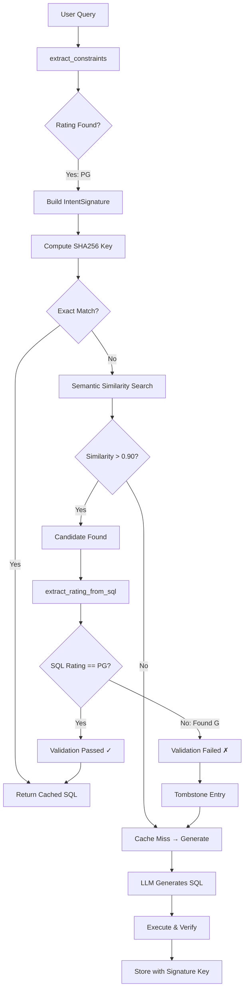

# Cache Stabilization: End-to-End Flow

This document traces how the query **"Show me top 10 rated PG films by average length"** is processed through the cache system, highlighting all changes from the `feature/stabilize-sql-cache-aliasing` branch.

## Commits on Feature Branch

```
6066b0e feat(cache): Complete remaining phases (4-7)
90f2e2f feat(cache): Add IntentSignature for exact-match cache keying (Phase 3)
35a3db4 feat(cache): Add instrumentation and replay harness (Phase 2)
305ec90 feat(cache): Add deterministic constraint guardrails (Phase 1)
```

---

## Step 1: Query Enters `cache_lookup_node`

The query arrives at [`cache_lookup_node`](file:///Users/jonathan/Documents/git/text2sql/agent/src/agent_core/nodes/cache_lookup.py):

```python
# cache_lookup_node receives:
user_query = "Show me top 10 rated PG films by average length"
tenant_id = 1
```

---

## Step 2: Constraint Extraction (Phase 1)

The [`extract_constraints()`](file:///Users/jonathan/Documents/git/text2sql/agent/src/agent_core/cache/constraint_extractor.py) function parses the query using regex patterns:

```python
from agent_core.cache import extract_constraints

constraints = extract_constraints("Show me top 10 rated PG films by average length")

# Result:
QueryConstraints(
    rating="PG",           # Matched pattern: r"\bPG\b"
    limit=10,              # Matched pattern: r"\btop\s+(\d+)\b"
    include_ties=False,    # No "with ties" or "including ties"
    entity="film",         # Matched pattern: r"\bfilms?\b"
    metric="avg",          # Matched pattern: r"\baverage\b"
    confidence=1.0         # High confidence (rating found)
)
```

### Pattern Matching Details

| Field | Pattern | Input Match |
|-------|---------|-------------|
| rating | `r"\bPG\b"` | "PG" |
| limit | `r"\btop\s+(\d+)\b"` | "top 10" |
| entity | `r"\bfilms?\b"` | "films" |
| metric | `r"\baverage\b"` | "average" |

---

## Step 3: Intent Signature Generation (Phase 3)

The [`build_signature_from_constraints()`](file:///Users/jonathan/Documents/git/text2sql/agent/src/agent_core/cache/intent_signature.py) creates a canonical signature:

```python
from agent_core.cache import build_signature_from_constraints

signature = build_signature_from_constraints(
    query="Show me top 10 rated PG films by average length",
    rating="PG",
    limit=10,
    entity="film",
    metric="avg"
)

# signature.to_dict():
{
    "intent": "top_films",
    "entity": "film",
    "item": "film",
    "metric": "avg",
    "filters": {"rating": "PG"},
    "ranking": {"limit": 10}
}
```

### Canonical JSON & Cache Key

```python
# Canonical JSON (sorted keys, no whitespace):
signature.to_canonical_json()
# '{"entity":"film","filters":{"rating":"PG"},"intent":"top_films","item":"film","metric":"avg","ranking":{"limit":10}}'

# SHA256 hash of canonical JSON:
signature.compute_key()
# "a7f3b2c1d4e5f6g7h8i9j0k1l2m3n4o5p6q7r8s9t0u1v2w3x4y5z6a7b8c9d0e1"
```

> **Critical**: A query for "G" films would produce a **completely different** signature key because `{"rating":"G"}` hashes to a different value than `{"rating":"PG"}`.

---

## Step 4: Cache Lookup

The MCP tool performs two-tier lookup:

### 4a. Signature-Based Lookup (Exact Match)

First, tries exact match on `signature_key`:

```sql
SELECT cache_id, generated_sql, user_query
FROM semantic_cache
WHERE tenant_id = 1
  AND signature_key = 'a7f3b2c1...'  -- Exact hash match
  AND (is_tombstoned IS NULL OR is_tombstoned = FALSE)
LIMIT 1
```

If found → **Cache hit with 100% confidence** (no validation needed)

### 4b. Semantic Similarity Fallback

If no exact match, falls back to vector similarity:

```sql
SELECT cache_id, generated_sql, user_query,
       (1 - (query_embedding <=> $embedding)) as similarity
FROM semantic_cache
WHERE tenant_id = 1
  AND (1 - (query_embedding <=> $embedding)) >= 0.90
  AND (is_tombstoned IS NULL OR is_tombstoned = FALSE)  -- NEW: Skip tombstoned
ORDER BY similarity DESC
LIMIT 1
```

---

## Step 5: Guardrail Validation (Phase 1)

If semantic lookup returns a candidate, the [`validate_sql_constraints()`](file:///Users/jonathan/Documents/git/text2sql/agent/src/agent_core/cache/sql_constraint_validator.py) function validates it:

```python
from agent_core.cache import validate_sql_constraints

# Assume cache returned this SQL (for a different rating):
cached_sql = """
SELECT title, AVG(length)
FROM film
WHERE rating = 'G'  -- WRONG! User asked for PG
GROUP BY title
ORDER BY AVG(length) DESC
LIMIT 10
"""

result = validate_sql_constraints(cached_sql, constraints)

# Result:
ValidationResult(
    is_valid=False,  # REJECTED!
    mismatches=[
        ConstraintMismatch(
            constraint_type="rating",
            expected="PG",
            found="G",
            message="Rating mismatch: expected 'PG', found 'G'"
        )
    ],
    extracted_predicates={"rating": "G", "limit": 10}
)
```

### SQL AST Parsing

The validator uses `sqlglot` to parse the SQL and extract predicates:

```python
import sqlglot
from sqlglot import exp

ast = sqlglot.parse_one(cached_sql, dialect="postgres")

# Find WHERE clause predicates
for eq in ast.find_all(exp.EQ):
    if eq.left.name.lower() == "rating":
        found_rating = eq.right.this  # "G"
```

---

## Step 6: Cache Miss / Tombstone (Phase 7)

When validation fails:

1. **Reject cached SQL** → Treat as cache miss
2. **Tombstone the entry** (Phase 7):

```python
from mcp_server.services.cache_service import tombstone_cache_entry

await tombstone_cache_entry(
    cache_id="123",
    tenant_id=1,
    reason="rating_mismatch: expected PG, found G"
)
```

This marks the entry as invalid without deleting it:

```sql
UPDATE semantic_cache
SET is_tombstoned = TRUE,
    tombstone_reason = 'rating_mismatch: expected PG, found G',
    tombstoned_at = NOW()
WHERE cache_id = 123
```

---

## Step 7: MLflow Tracing (Phase 2)

All steps are logged to MLflow with structured attributes:

```python
with mlflow.start_span("cache_lookup") as span:
    span.set_attributes({
        "extracted_constraints": constraints.to_json(),
        "extraction_confidence": 1.0,
        "signature_key": signature.compute_key(),
        "lookup_mode": "semantic_fallback",
        "cache_id": "123",
        "similarity_score": 0.94,
        "guardrail_verdict": "REJECTED",
        "mismatch_details": '{"rating": {"expected": "PG", "found": "G"}}',
        "rejection_reason": "constraint_mismatch"
    })
```

---

## Step 8: Generate Fresh SQL

Since validation failed, the workflow proceeds to `generate_sql_node` which:

1. Retrieves schema context from graph
2. Gets few-shot examples
3. Calls LLM to generate correct SQL:

```sql
SELECT title, AVG(length) as avg_length
FROM film
WHERE rating = 'PG'  -- Correct rating
GROUP BY title
ORDER BY avg_length DESC
LIMIT 10
```

---

## Step 9: Store New Cache Entry

After successful execution, the new SQL is cached with:

- **Embedding** of the original query
- **Signature key** for exact matching
- **Intent signature** JSON for debugging

```sql
INSERT INTO semantic_cache (
    tenant_id, user_query, generated_sql, query_embedding,
    signature_key, intent_signature, schema_version
)
VALUES (
    1,
    'Show me top 10 rated PG films by average length',
    'SELECT title, AVG(length)...',
    '[0.123, 0.456, ...]',
    'a7f3b2c1...',
    '{"entity":"film","filters":{"rating":"PG"},...}',
    'v1'
)
```

---

## Visual Flow Diagram



---

## Key Guarantees

| Scenario | Before (LLM validation) | After (Deterministic) |
|----------|------------------------|----------------------|
| PG query, G cached SQL | Might return wrong SQL | **Always rejected** |
| Exact same query | Semantic match (≈95%) | **Exact key match (100%)** |
| Invalid entry | Kept in cache | **Tombstoned for audit** |
| Rating extraction | LLM interpretation | **Regex + AST parsing** |

---

## Files Changed Summary

| Commit | Key Files | Purpose |
|--------|-----------|---------|
| Phase 1 | `constraint_extractor.py`, `sql_constraint_validator.py` | Deterministic extraction & validation |
| Phase 2 | `cache_metrics.py`, `replay_cache_tests.py` | Observability & testing |
| Phase 3 | `intent_signature.py`, `08-add-signature-key.sql` | Exact-match keying |
| Phase 4-7 | `09-add-tombstone-columns.sql`, `semantic_cache.py` | Tombstoning & hygiene |
